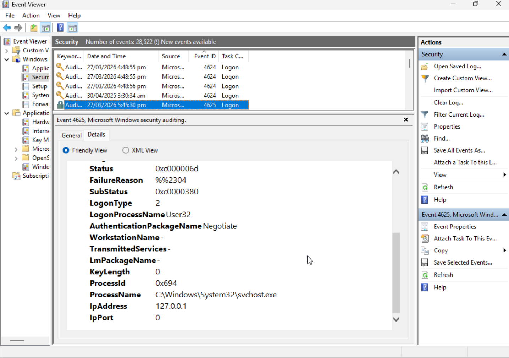
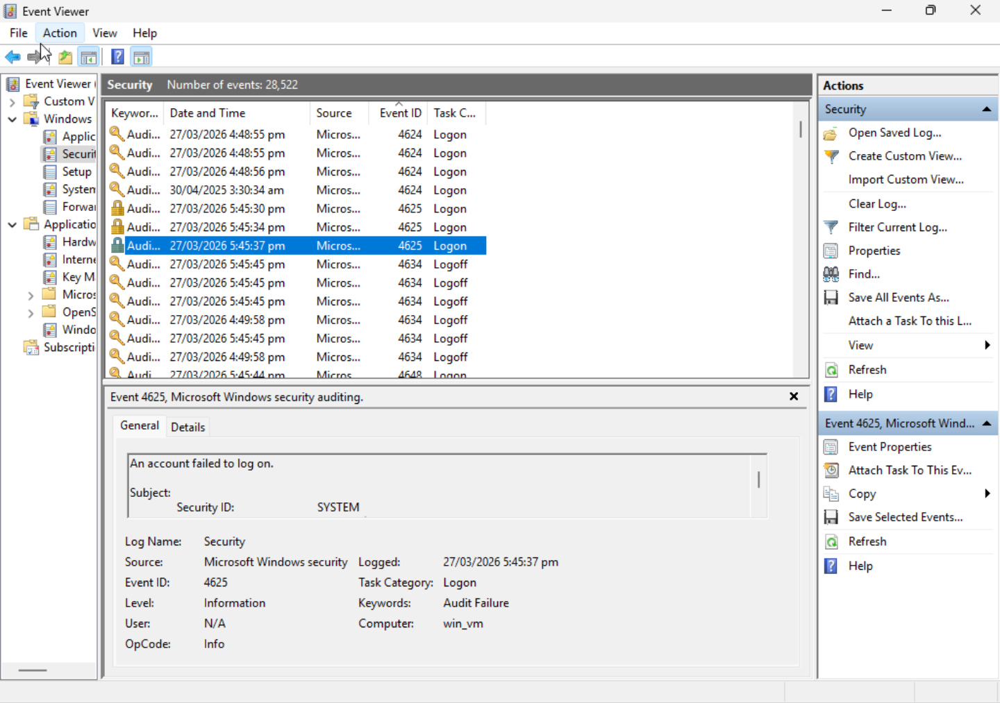

# Windows SOC Lab with Sysmon

## Overview
This project demonstrates a Windows SOC lab built on a local Windows VM using Sysmon and native Windows Event Logs. The objective was to generate and investigate process creation activity and failed logon events to simulate basic host-based security monitoring.

## Technologies Used
- Sysmon64a
- Windows Event Viewer
- PowerShell
- Command Prompt

## Detection Use Cases
1. Process and PowerShell activity review using Sysmon
2. Repeated failed logons using Windows Security Event ID 4625

## Key Evidence
- Captured Sysmon Event ID 1 and Event ID 5 telemetry successfully
- Observed process creation events for whoami.exe, hostname.exe, ipconfig.exe, mmc.exe, and powershell.exe
- Generated and reviewed multiple Windows Security Event ID 4625 failed logon events

## Notable Findings
- Interactive failed logons were recorded with LogonType 2
- Authentication failure details included Status 0xc000006d and SubStatus 0xc0000380
- Local source context showed IpAddress 127.0.0.1
- Sysmon process creation telemetry provided useful fields such as Image, CommandLine, User, ProcessId, and UtcTime

## Featured Screenshots

### Failed logon overview

### Failed logon details

### Sysmon process creation evidence

