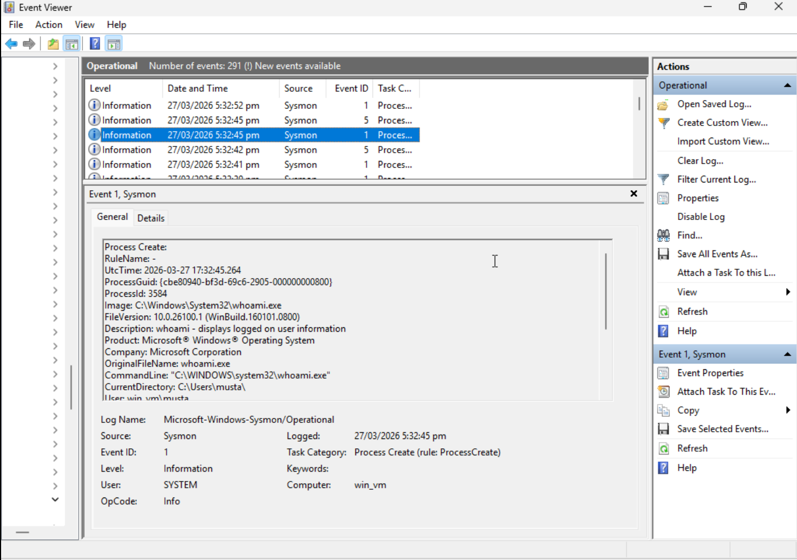
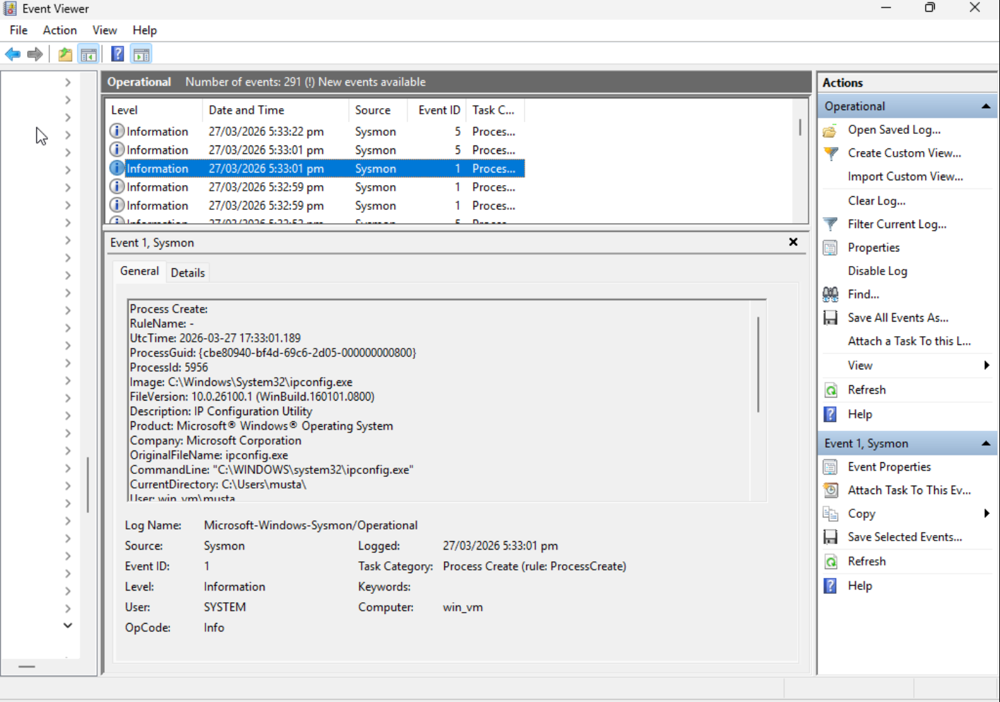
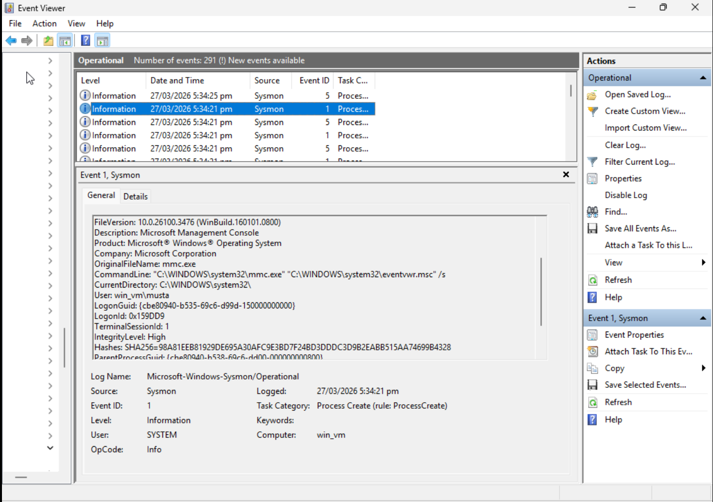

# Detection: Process and PowerShell Activity Review

## Objective
Review process creation activity on a Windows host to identify potentially suspicious command-line execution.

## Log Source
`Microsoft-Windows-Sysmon/Operational`

## Relevant Event IDs
- `1` — Process creation
- `5` — Process termination

## Detection Logic
Review Sysmon events for command-line tools and administrative utilities, including `powershell.exe`, `whoami.exe`, `hostname.exe`, `ipconfig.exe` and `mmc.exe`. Capture the image path, command line, execution time, and user context.

## Why It Matters
Process creation telemetry helps analysts understand what ran on a host and under which user context. Tools such as PowerShell and command-line utilities are widely used in both normal administration and malicious activity.

## Lab Evidence

A Sysmon Event ID 1 entry for `whoami.exe` shows a simple command-line utility execution with process metadata.

A Sysmon Event ID 1 entry for `ipconfig.exe` shows process execution and command-line context for a common host reconnaissance command.

A Sysmon Event ID 1 entry for `mmc.exe` captures Event Viewer being launched via the Microsoft Management Console.

## Analyst Notes
Useful fields include:
- `Image`
- `CommandLine`
- `ProcessId`
- `UtcTime`

In a larger environment, similar telemetry would be reviewed for unexpected parent-child relationships, unusual execution timing, or suspicious command-line arguments.
